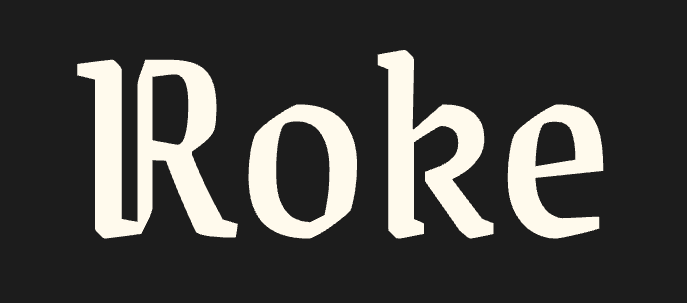

# Roke

<div>
  

  <p>
    A Full-Stack Wasp Starter with Modern UI Components
  </p>

  <p>
    <a href="https://roke.dev">Documentation</a>
    ·
    <a href="https://github.com/wardbox/roke/issues">Report Bug</a>
    ·
    <a href="https://github.com/wardbox/roke/issues">Request Feature</a>
  </p>
</div>

## Overview

Roke provides a comprehensive foundation for your Wasp projects by combining
modern UI tools and best practices. Built with shadcn/ui components, Motion
animations, and TypeScript support, it helps developers create beautiful,
interactive web applications efficiently.

## Quick Start

Click "Use this template" button at the top of the repository

```bash
# Start the development server
wasp db start
wasp db migrate-dev
wasp start
```

Visit [roke.dev](https://roke.dev) for comprehensive documentation.

## Features

- 🎨 Elegant Dark/Light mode theming
- 📚 Ready-to-use shadcn/ui components
- 🔐 Secure authentication flows with customizable styling
- 🎭 Smooth animations powered by Motion
- 📱 Responsive, mobile-first design
- 🧩 Clean, modular architecture
- 🛠️ Full TypeScript support

## Included Components

- Responsive navigation with mobile menu
- Form components with validation
- Toast notifications system
- Syntax-highlighted code blocks
- Helpful utility functions
  - Date formatting
  - Text manipulation
  - Theme management
  - And more...

## Contributing

We welcome contributions! Whether it's:

- 🐛 Bug fixes
- ✨ New features
- 📝 Documentation improvements
- 💡 Suggestions

Feel free to open an issue or submit a pull request.

## Learn More

- [Documentation](https://roke.dev)
- [Wasp Documentation](https://wasp-lang.dev)
- [shadcn/ui](https://ui.shadcn.com)
- [Motion](https://motion.dev)

## License

MIT License - feel free to use this in your own projects!
